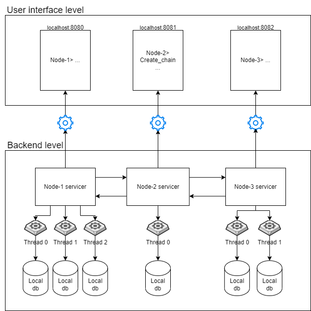

# Book shop using gRPC

### Software Architecture Blueprint

The application is distributed across 3 nodes. On the user interface level, each node has its own CLI which accepts commands, such as Create_chain, List_chain, Write, etc, and triggers respective RPC methods of its own servicer. Each servicer is connected with other nodes via RPC connections in order to be able to communicate different changes in the entire data store. In addition, each servicer is running `k` local threads each having a local store. Some nodes may be more powerful having more threads and vice versa which is configurable by the user with Local_store_ps command. In order to operate with the book shop, you need to create a random chain of threads, which connects all the threads across the nodes in one sequence. When the chain is created, the writes to the data store are traversed throughout the whole chain. On the forward pass (from head to tail), the threads write the key-value pair to the local store with the `DIRTY` tag whereas on the backward pass (from tail to head) each thread commits the write putting the pair with `CLEAN` tag. Only clean data is visible to the user, which can be inspected with Data_status and List_books commands. Furthermore, each node is able to change the state of the chain removing or restoring the head respectively. When the head is removed, the current head begins from next position and all the writes will be synchronized with it accordingly.

### Instalation

To run the following app you need to
  * clone the repo
  * open 3 terminals in the project folder
  * run "python node.py [node_id]" for each of the terminals. You should use 0, 1, 2 ids.

### Usage:
  * Initialize the number of processes for each of the node by running "Local_store_ps [num_procs]"
  * Create chain by running "Create_chain". You are able to list the chain by running "List_chain".
  It is also possible to remove and restore heads by running "Remove_head" and "Restore_head"
  * Now you are able to write and read by using "Write [book_name] [price]" and "Read [book_name]"
  * You can list all of the books available by running "List_books"
  * You can list the status of each of the books by running "Data_status"
  * To terminate the app you should press ctrl+c in each of the terminals
  
  
  
### Project members:
  * Illia Tsiporenko
  * Dmytro Shvetsov 
  
